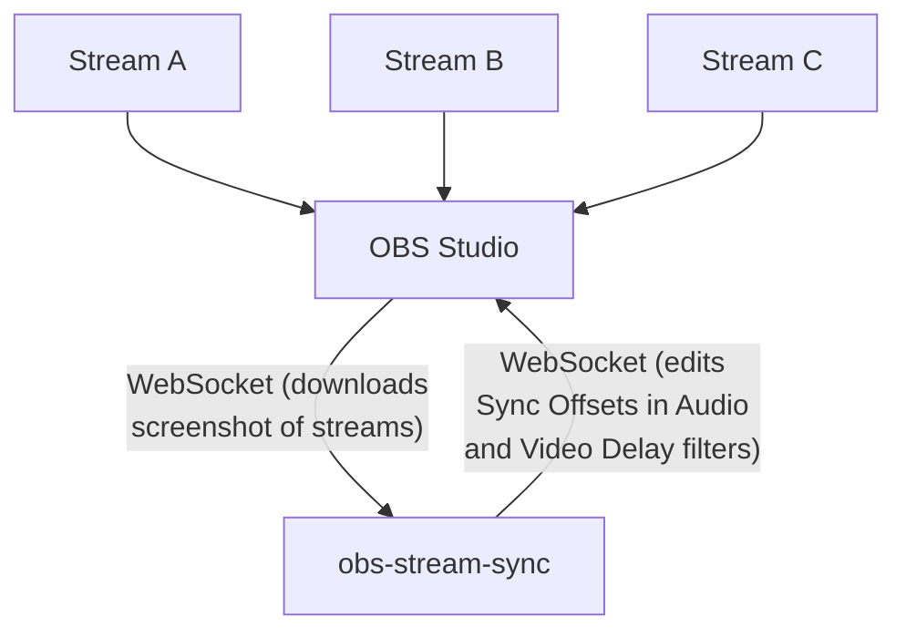

# obs-stream-sync

`obs-stream-sync` is a Node.js program that visually reads timestamps on OBS stream sources, calculates proper delays, and then syncs audio and video together.

[Download App](https://github.com/some1chan/obs-stream-sync/releases/) - [Download Scene Collection and Profile](https://g.co)

## Table of Contents

-   [How it works](#how-it-works)
-   [Troubleshooting](#troubleshooting)
-   [Want to Contribute?](#want-to-contribute)
-   [Special Thanks](#special-thanks)

## How It Works

-   Each client/streamer whose stream needs to be synced has a special layout. This layout has URL sources connected to [qr.syncer.live](https://qr.syncer.live) that displays a synced-up time, similar to [time.curby.net](https://time.curby.net/clock). Theoretically, the same thing will be displayed will be shown on everyone's stream at the exact same time from this.
-   The host who's injesting everyone's streams runs `obs-stream-sync`. This program will hook into your local OBS instance via OBS's WebSocket Server.
-   The program checks for a Scene named "Stream Sources" in your Sources for livestreams. It'll request screenshots from OBS, and will read the QR Codes from it.
    -   You can change the name in the auto-generated `config.ini`

## How to Set Up

1. [Download the app](https://github.com/some1chan/obs-stream-sync/releases/), and follow the instructions given in the app. This will help you connect your local OBS instance with it.
1. For remote OBS clients, [download the Scene Collection and Profile](https://g.co), and load them in with **Profile > Import** and **Scene Collection > Add**, then import them both.

## config.ini

Check out [`config.example.ini`](./config.example.ini) for all the configuration options `obs-stream-sync` allows. All that is contained uses default values, but are now explicit.

> It's **highly recommended you first launch the application**, and follow the instructions before copying parts of `config.example.ini` file. This will make sure you setup your local OBS instance connects.

## Troubleshooting

The program says in OBS to go to <b>Tools > WebSocket Server Settings</b>, but there is no option!

 
There's a few reasons why this could happen:

1.  You're likely running an outdated version of OBS Studio, which doesn't bundle `obs-websocket` by default.

    > Solutions:
    >
    > -   Update OBS to a version higher than v27.
    >     -   In OBS, select **Help > Check For Updates**. This should prompt you to update.
    > -   Install [obs-websocket](https://obsproject.com/forum/resources/obs-websocket-remote-control-obs-studio-using-websockets.466/) manually, however, v28 and under is untested, and updating is recommended.

2.  You OBS installation didn't add `obs-websocket` when updating to a newer version.

    > Solution:
    >
    > -   In OBS, select **Help > Check File Integrity**, then select **Yes**. This will download the missing `obs-websocket` files.

The program is giving me an ECONNREFUSED error, and won't connect!

 

Check to see if the OBS WebSocket Server is enabled, by going to **Tools > WebSocket Server Settings** in OBS. If there's no WebSocket Server Settings option, select **Help > CHeck File Integrity**.

You should also make sure your OBS is at least v29 or up, in case you're trying to connect to an older, incompatible v4 version of OBS WebSocket. This program only works with v5. If not, either upgrade your OBS (recommended) or attempt to install [obs-websocket](https://obsproject.com/forum/resources/obs-websocket-remote-control-obs-studio-using-websockets.466/) manually (not recommended).

The program is getting timeout connection errors with localhost, and won't connect!

 

If you have [Portmaster](https://github.com/safing/portmaster/) installed, this may cause local networking issues. If you must have it installed, try alternate local IPs, such as your device IP. Search "find device ip address" on your favorite search engine, and specify your operating system in it. The namespace localhost may also be affected. See if 127.0.0.1 directly instead fixes the issue.

If you would like to sanity check if you can connect to your OBS instance at all, try [obs-web.niek.tv](http://obs-web.niek.tv/), and make sure it's in HTTP mode.

## Want to Contribute?

Feel free to open an issue or pull request! Also, check out [MAINTAINERS.md](./docs/MAINTAINERS.md) on info on how to setup a development environment locally.

## Special Thanks

[Zusor](https://zusor.io) - Making time-syncing possible with [qr.syncer.live](https://qr.syncer.live)
